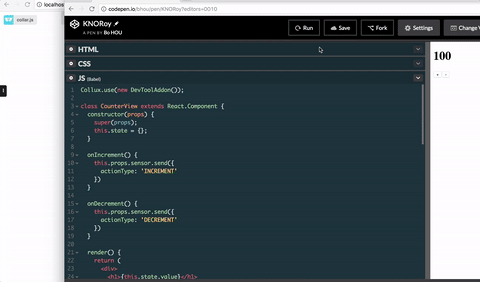
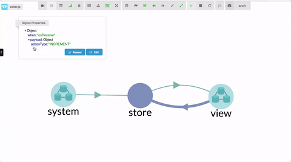
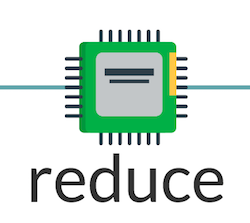
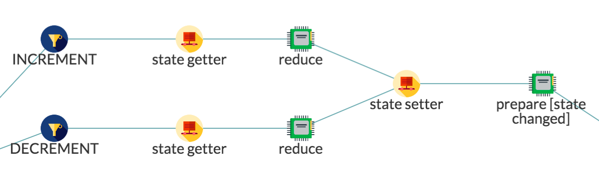
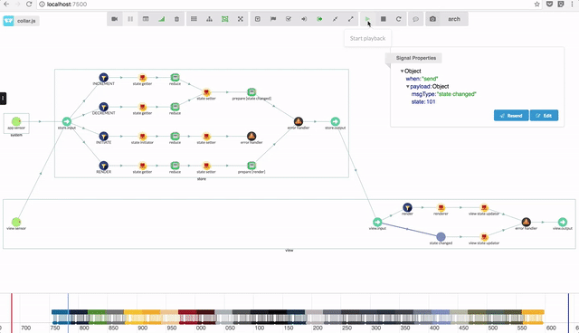
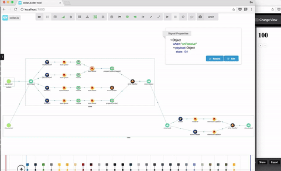
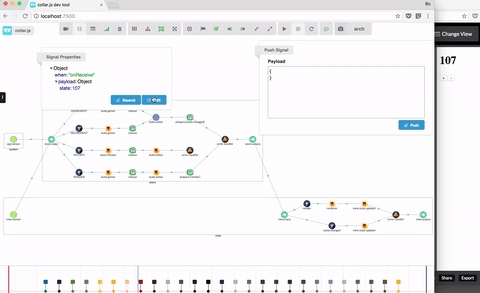

# Understand Redux architecture with Collux

Collux is a redux framework implemented with collar.js. With collar dev tool, you can visualize the architecture, data flow, and business logic of your application. It is very easy to learn, and understand Redux architecture with collux.

In this chapter, I will use collux and collar dev tool to introduce several important concepts of Redux architecture.

## Single Store, Single State Object

In Redux architecture, the application state is stored in a single state object, and managed by a single store. You can visualize your application's architecture in collar dev tool:



Take the counter demo for example, first run *collar-dev-server* on you computer, and open [http://localhost:7500] in browser. Run the demo counter app from codepen:
[http://codepen.io/bhou/pen/KNORoy](http://codepen.io/bhou/pen/KNORoy). In collar dev server, choose *arch* perspective and *toggle hierarchy top down view* in the toolbar.

The architecture looks like the following diagram:


In the architecture, you can find only one store component.

## Unidirectional data flow

Like Flux architecture, Redux has a unidirectional data flow: the view can send an action to the store to make change to the state. Store is the only component who has the knowledge of how to handle the action and modify the state. When state changes, store will notify the view the state change to update the UI. In collux, store will push the new state to the view.

The unidirectional data flow look like this:

```
[view] ---(action)---> [store] ---(new state)---> [view]
```

By using the playback feature of collar dev tool, you can visualize this unidirectional data flow very easily:



## Reducer

In Redux, store uses reducer to process action. A reducer is a pure function, it does not make any side effects. Its output only depends on its input. In collar.js, such pure function are represented as a *processor* (See more detail in [Collar.js In 5 minutes](COLLAR.md)) and displayed as the following icon:



A reducer function has following signature:

```javascript
function reducer(prevState, action) => newState
```

In collar dev tool, you can find the following data flow for a reducer:



Before we call the *reducer* function, we first call *state getter* to get the current state, and pass the current state to *reducer* function as the previous state. The return value of the *reducer* function is the new state, which will be passed to *state setter* to save in the store. A *state changed* message will be emitted to the view to notify the new state.

Check the following live data flow to understand how action is handled by reducer and how the new state propagates to the view



## Time traveling

Time traveling is a very cool feature supported by Redux dev tool. As Redux has a unique store to manage the application state, it can track a history of your application state. In Redux dev tool, you can pick one of the history state, and travel back to that state. This is a very useful feature to debug and develop your application.

In collar dev tool, this feature is supported by nature, you don't need to install another dev tool to make the time traveling. See the following gif:



You can not only travel back to a history state, but also travel to the future! (see the gif:)



&nbsp;

&nbsp;

&nbsp;
