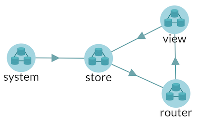
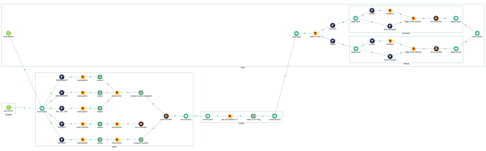

# ReduxMultipleRoutesApp

ReduxMultipleRoutesApp class. The predefined architecture for multiple routes redux application.

In multipls routes redux application, there are four components:

- store component
- router component
- view component
- system component



See the following diagram to understand the architecture and data flow of redux multiple routes application architecture. (This diagram is generated from [collar dev tool](http://collarjs.com))




## ReduxMultipleRoutesApp(options)

constructor, create a redux multipl routes app. You don't need to call this constructor directly, you can use [*Collux.createApp('redux-multiple-routes-app', options)*](Collux.md) function to create a multiple routes redux application. Use the following options to fill the second argument.

#### Arguments
| Arguement | Type | Description |
| -- | -- | -- |
| options.getName | Function | a function to return app name, function(): string |
| options.initState | Function | storeStateInitiator function, function(): state |




create a redux single route application
```javascript
const app = Collux.createApp('redux-multiple-routes-app', {
  initState: () => {
    return 100;
  }
});
```





## ReduxMultipleRoutesApp.route(path, page)

Create a route and a page object to handle it. Each page object must contain two functions:

- render() : void
- updateState(state) : void

#### Arguments
| Arguement | Type | Description |
| -- | -- | -- |
| path | String | express like url path |
| page.render | Function | render function, function(): void |
| page.updateState | Function | viewStateUpdater function, function(state): void |



Add a route to handle '/home' url
```javascript
app.route('/home', {
	render: () => {
		viewComponent = ReactDOM.render(
			<Home sensor={app.getViewSensor()}/>,
			document.getElementById('root')
		)
	},

	updateState: (state) => {
		viewComponent.setState(state);
	}
});
```





## ReduxMultipleRoutesApp.Link

The React Component to support client side routing. This Link component is different from [Collux.Link](Collux.md) React component, you don't need to specify the sensor property to it. It has already inherited the application view sensor from application object.

#### Properties
| Property | Type | Description |
| -- | -- | -- |
| to | String | the url path to link to |



A client side link to '/user'

```javascript
// get the Link component from multiple route application
const Link = app.Link;

// use it in JSX
<Link to="/user">This is a client side router link</Link>
```




## ReduxMultipleRoutesApp.setDefaultRoute(route)

Set the default route of the application. By default, the default route is '/'

#### Arguments
| Arguement | Type | Description |
| -- | -- | -- |
| route | String | the default route path |



Create a reducer to handle 'INCREMENT' action
```javascript
// set the default route to '/counter'
app.setDefaultRoute('/counter');
```





## ReduxMultipleRoutesApp.reduce(actionName, reducer)

Create a reducer to handle action

#### Arguments
| Arguement | Type | Description |
| -- | -- | -- |
| action | String | the action to handle |
| reducer | Function | function(prevState, action) : void |



Create a reducer to handle 'INCREMENT' action
```javascript
app.reduce('INCREMENT', (prevState, action) => {
  return prevState + 1;
})
```




## ReduxMultipleRoutesApp.setStoreStateInitiator(initiator)

Set a store state initiator to initiate the store state.

#### Arguments
| Arguement | Type | Description |
| -- | -- | -- |
| initiator | Function | initiator function, function(): state |



render a counter view
```javascript
app.setStoreStateInitiator(() => {
  return 100; // the initial state
})
```




## ReduxMultipleRoutesApp.store

Property: the store component



## ReduxMultipleRoutesApp.view

Property: the view component



## ReduxMultipleRoutesApp.getAppSensor()

Get the application sensor. Application sensor is used to listen to the system/application level events.




## ReduxMultipleRoutesApp.getViewSensor()

Get the view sensor. View sensor is used to listen to the UI events.




## ReduxMultipleRoutesApp.setStore(store)

Set a custom store component. Use this method to override the default store component

#### Arguments
| Arguement | Type | Description |
| -- | -- | -- |
| store | [Component](Component.md) | component object |




## ReduxMultipleRoutesApp.setView(view)

Set a custom view component. Use this method to override the default view component

#### Arguments
| Arguement | Type | Description |
| -- | -- | -- |
| view | [Component](Component.md) | component object |




&nbsp;

&nbsp;

&nbsp;
