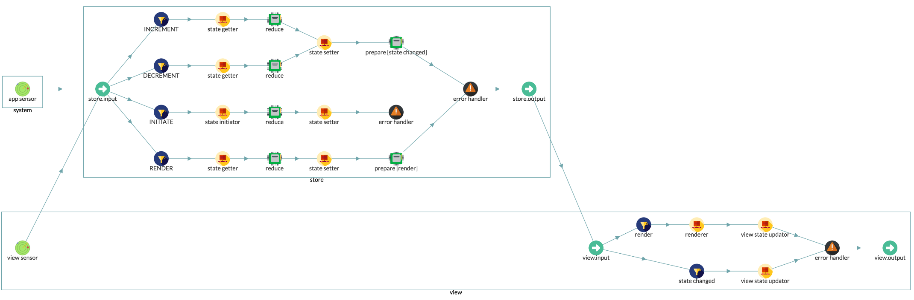

# ReduxSingleRouteApp

ReduxSingleRouteApp class. The predefined architecture for single route redux application.

In single route redux application, there are three components:

- store component
- view component
- system component


See the following diagram to understand the architecture and data flow of redux single route application architecture. (This diagram is generated from [collar dev tool](http://collarjs.com))




## ReduxSingleRouteApp(options)

constructor, create a redux single route app. You don't need to call this constructor directly, you can use [*Collux.createApp('redux-single-route-app', options)*](Collux.md) function to create a single route redux application. Use the following options to fill the second argument.

#### Arguments
| Arguement | Type | Description |
| -- | -- | -- |
| options.getName | Function | a function to return app name, function(): string |
| options.render | Function | render function, function(): void |
| options.initState | Function | storeStateInitiator function, function(): state |
| options.updateState | Function | viewStateUpdater function, function(state): void |



create a redux single route application
```javascript
const app = Collux.createApp('redux-single-route-app', {
  initState: () => {
    return 100;
  },
  render: () => {
    // render the view here
  },
  updateState: (state) => {
    // update the view state
  }
});
```




## ReduxSingleRouteApp.reduce(actionName, reducer)

Create a reducer to handle action

#### Arguments
| Arguement | Type | Description |
| -- | -- | -- |
| action | String | the action to handle |
| reducer | Function | function(prevState, action) : void |



Create a reducer to handle 'INCREMENT' action
```javascript
app.reduce('INCREMENT', (prevState, action) => {
  return prevState + 1;
})
```





## ReduxSingleRouteApp.setRenderer(renderer)

Set a renderer to render the view

#### Arguments
| Arguement | Type | Description |
| -- | -- | -- |
| renderer | Function | render function, function(state): void |



render a counter view
```javascript
app.setRenderer((state) => {
  ReactDOM.render(
    <CounterView/>,
    document.getElementById('root')
  )
})
```




## ReduxSingleRouteApp.setViewStateUpdater(updater)

Set a view state updater to update the view according to new state

#### Arguments
| Arguement | Type | Description |
| -- | -- | -- |
| updater | Function | updater function, function(state): void |



render a counter view
```javascript
app.setViewStateUpdater((state) => {
  counterView.setState({
    value: state
  })
})
```




## ReduxSingleRouteApp.setStoreStateInitiator(initiator)

Set a store state initiator to initiate the store state.

#### Arguments
| Arguement | Type | Description |
| -- | -- | -- |
| initiator | Function | initiator function, function(): state |



render a counter view
```javascript
app.setStoreStateInitiator(() => {
  return 100; // the initial state
})
```




## ReduxSingleRouteApp.store

Property: the store component



## ReduxSingleRouteApp.view

Property: the view component



## ReduxSingleRouteApp.getAppSensor()

Get the application sensor. Application sensor is used to listen to the system/application level events.




## ReduxSingleRouteApp.getViewSensor()

Get the view sensor. View sensor is used to listen to the UI events.




## ReduxSingleRouteApp.setStore(store)

Set a custom store component. Use this method to override the default store component

#### Arguments
| Arguement | Type | Description |
| -- | -- | -- |
| store | [Component](Component.md) | component object |




## ReduxSingleRouteApp.setView(view)

Set a custom view component. Use this method to override the default view component

#### Arguments
| Arguement | Type | Description |
| -- | -- | -- |
| view | [Component](Component.md) | component object |




&nbsp;

&nbsp;

&nbsp;
